# Diagrama de Classes — Sistema de Gestão de Matrículas (SGM)

Diagrama baseado nos modelos reais do backend Django e nas funcionalidades do frontend React.

## 1. Diagrama de Classes (Mermaid)

```mermaid
classDiagram

    %% ═══════════════════════════════════════════
    %%  MÓDULO: UTILIZADORES E ACESSOS
    %% ═══════════════════════════════════════════

    class Cargo {
        +int id_cargo
        +string nome_cargo
        +listar() List~Cargo~
        +criar(nome_cargo) Cargo
        +editar(id, dados) Cargo
        +eliminar(id) void
    }

    class Usuario {
        +int id_usuario
        +string nome_completo
        +string email
        +string senha_hash
        +string papel
        +bool is_active
        +bool is_superuser
        +bool is_funcionario
        +list permissoes
        +string telefone
        +string bairro_residencia
        +image img_path
        +bool is_online
        +autenticar(email, senha) Token
        +editarPerfil(dados) Usuario
        +alterarSenha(nova_senha) void
        +definirPermissoes(permissoes) void
    }

    class Funcionario {
        +int id_funcionario
        +string codigo_identificacao
        +string nome_completo
        +string numero_bi
        +string genero
        +string email
        +string telefone
        +string provincia_residencia
        +string municipio_residencia
        +string bairro_residencia
        +string senha_hash
        +string status_funcionario
        +date data_admissao
        +list permissoes_adicionais
        +bool is_online
        +image img_path
        +iniciarSessao(email, senha) Token
        +solicitarRecuperacaoSenha(email) void
        +definirNovaSenha(token, nova_senha) void
        +editarPerfil(dados) Funcionario
        +ativar() void
        +desativar() void
    }

    class Encarregado {
        +int id_encarregado
        +string nome_completo
        +string numero_bi
        +string profissao
        +string email
        +list telefone
        +string provincia_residencia
        +string municipio_residencia
        +string bairro_residencia
        +string numero_casa
        +image img_path
        +criar(dados) Encarregado
        +editar(id, dados) Encarregado
    }

    class CargoFuncionario {
        +int id_cargo_funcionario
        +date data_inicio
        +date data_fim
    }

    %% ═══════════════════════════════════════════
    %%  MÓDULO: ANO LECTIVO E ESTRUTURA ACADÉMICA
    %% ═══════════════════════════════════════════

    class AnoLectivo {
        +int id_ano
        +string nome
        +date data_inicio
        +date data_fim
        +date inicio_inscricoes
        +date fim_inscricoes
        +date inicio_matriculas
        +date fim_matriculas
        +date data_exame_admissao
        +string status
        +bool activo
        +bool fecho_automatico_inscricoes
        +criar(dados) AnoLectivo
        +definirComoActivo() void
        +fecharAno() void
        +configurarCronograma(datas) void
        +abrirPortalCandidaturas() void
        +fecharPortalCandidaturas() void
        +getAnoActivo() AnoLectivo
    }

    class Sala {
        +int id_sala
        +int numero_sala
        +int capacidade_alunos
        +string bloco
        +criar(dados) Sala
        +editar(id, dados) Sala
        +eliminar(id) void
        +listar() List~Sala~
    }

    class Classe {
        +int id_classe
        +int nivel
        +string descricao
        +criar(dados) Classe
        +editar(id, dados) Classe
        +eliminar(id) void
    }

    class Periodo {
        +int id_periodo
        +string periodo
        +criar(dados) Periodo
        +editar(id, dados) Periodo
    }

    class AreaFormacao {
        +int id_area_formacao
        +string nome_area
        +criar(dados) AreaFormacao
        +editar(id, dados) AreaFormacao
        +eliminar(id) void
    }

    class Curso {
        +int id_curso
        +string nome_curso
        +int duracao
        +criar(dados) Curso
        +editar(id, dados) Curso
        +eliminar(id) void
        +listar() List~Curso~
    }

    class Turma {
        +int id_turma
        +string codigo_turma
        +int capacidade
        +string status
        +criar(dados) Turma
        +editar(id, dados) Turma
        +eliminar(id) void
        +listar() List~Turma~
        +listarActivas() List~Turma~
        +listarConcluidas() List~Turma~
    }

    class VagaCurso {
        +int id
        +int vagas
        +visualizarOcupacao() dict
        +definirVagas(n) void
        +actualizarVagas(n) void
    }

    %% ═══════════════════════════════════════════
    %%  MÓDULO: CANDIDATURA (PORTAL PÚBLICO)
    %% ═══════════════════════════════════════════

    class Candidato {
        +int id_candidato
        +string numero_inscricao
        +string nome_completo
        +string genero
        +date data_nascimento
        +string numero_bi
        +string nacionalidade
        +string naturalidade
        +string deficiencia
        +string provincia
        +string municipio
        +string residencia
        +string telefone
        +string email
        +string tipo_escola
        +string escola_proveniencia
        +string municipio_escola
        +int ano_conclusao
        +decimal media_final
        +string turno_preferencial
        +string status
        +image foto_passe
        +file comprovativo_bi
        +file certificado
        +string nome_encarregado
        +string parentesco_encarregado
        +string telefone_encarregado
        +string email_encarregado
        +string numero_bi_encarregado
        +submeterInscricao(dados) Candidato
        +consultarEstado(bi_ou_numero) Candidato
        +gerarRUP() RupeCandidato
        +confirmarPagamento() void
        +descarregarComprovativo() PDF
        +listar() List~Candidato~
        +pesquisar(termo) List~Candidato~
        +visualizarFicha(id) Candidato
        +editar(id, dados) Candidato
        +filtrar(params) List~Candidato~
        +lancarNotaExame(id, nota) void
        +distribuirPorSalas(config) void
        +imprimirListaChamada() PDF
        +matricular(id) Aluno
    }

    class ExameAdmissao {
        +int id_exame
        +datetime data_exame
        +decimal nota
        +bool realizado
        +agendar(candidato, sala, data) ExameAdmissao
        +lancarNota(nota) void
        +marcarRealizado() void
    }

    class RupeCandidato {
        +int id
        +string codigo_rup
        +string referencia_banco
        +decimal valor
        +datetime data_geracao
        +datetime data_expiracao
        +datetime data_pagamento
        +string status_rup
        +gerar(candidato) RupeCandidato
        +confirmarPagamento() void
        +verificarExpiracao() bool
    }

    class ListaEspera {
        +int id
        +datetime data_entrada
        +int prioridade
        +string observacao
        +string status
        +adicionarCandidato(candidato, prioridade, obs) ListaEspera
        +chamarParaVaga() void
        +remover() void
        +listar() List~ListaEspera~
    }

    %% ═══════════════════════════════════════════
    %%  MÓDULO: ALUNOS E MATRÍCULAS
    %% ═══════════════════════════════════════════

    class Aluno {
        +int id_aluno
        +string numero_bi
        +string nome_completo
        +date data_nascimento
        +string nacionalidade
        +string naturalidade
        +string deficiencia
        +string email
        +int numero_matricula
        +string telefone
        +string provincia_residencia
        +string municipio_residencia
        +string bairro_residencia
        +string genero
        +string status_aluno
        +image img_path
        +listar() List~Aluno~
        +pesquisar(termo) List~Aluno~
        +visualizarFicha(id) Aluno
        +editar(id, dados) Aluno
        +alterarStatus(status) void
        +consultarHistorico() List~Matricula~
    }

    class AlunoEncarregado {
        +int id_aluno_encarregado
        +string grau_parentesco
        +vincular(aluno, encarregado) void
        +desvincular() void
    }

    class Matricula {
        +int id_matricula
        +date data_matricula
        +string tipo
        +string status
        +bool ativo
        +file doc_certificado
        +file doc_bi
        +efectivar(aluno, turma, ano) Matricula
        +editar(id, dados) Matricula
        +anular(id) void
        +emitirComprovativo() PDF
        +consultarHistorico(aluno) List~Matricula~
        +transferirAluno(nova_turma) void
    }

    %% ═══════════════════════════════════════════
    %%  MÓDULO: CONFIGURAÇÕES DO SISTEMA
    %% ═══════════════════════════════════════════

    class ConfiguracaoEscola {
        +string nome_escola
        +string telefone
        +string email
        +string morada
        +image logo
        +string tema_cor
        +editar(dados) void
        +actualizarLogo(imagem) void
    }

    %% ═══════════════════════════════════════════
    %%  ASSOCIAÇÕES E HERANÇAS
    %% ═══════════════════════════════════════════

    %% Utilizadores
    Cargo "1" --> "0..*" Funcionario : atribuído a
    Cargo "1" --> "0..*" CargoFuncionario : registado em
    Funcionario "1" --> "0..*" CargoFuncionario : possui histórico
    Usuario "1" -- "0..1" Funcionario : é perfil de

    %% Estrutura Académica
    AnoLectivo "1" --> "0..*" Turma : contém
    AnoLectivo "1" --> "0..*" VagaCurso : define
    AnoLectivo "1" --> "0..*" Candidato : pertence
    Sala "1" --> "0..*" Turma : aloja
    Sala "1" --> "0..*" ExameAdmissao : recebe
    Classe "1" --> "0..*" Turma : classifica
    Periodo "1" --> "0..*" Turma : define turno
    Curso "1" --> "0..*" Turma : associado a
    Curso "1" --> "0..*" VagaCurso : tem vagas
    Curso "1" --> "0..*" Candidato : 1ª opção
    Curso "0..1" --> "0..*" Candidato : 2ª opção
    AreaFormacao "1" --> "0..*" Curso : agrupa
    Funcionario "0..1" --> "0..*" Curso : coordena
    Funcionario "0..1" --> "0..*" Turma : responsável
    Funcionario "0..1" --> "0..*" AreaFormacao : responsável

    %% Candidatura
    Candidato "1" --> "0..1" ExameAdmissao : realiza
    Candidato "1" --> "0..*" RupeCandidato : gera
    Candidato "1" --> "0..1" ListaEspera : entra em
    Candidato "1" --> "0..1" Aluno : converte-se em

    %% Alunos e Matrículas
    Aluno "1" --> "0..*" Matricula : possui
    Turma "1" --> "0..*" Matricula : recebe
    AnoLectivo "1" --> "0..*" Matricula : abrange
    Aluno "0..*" --> "0..*" Encarregado : tutelado por
    AlunoEncarregado .. Aluno : associação
    AlunoEncarregado .. Encarregado : associação
    Aluno "0..*" --> "0..1" Turma : alocado em
```

## 2. Resumo das Relações

| Relação | Tipo | Descrição |
| :--- | :---: | :--- |
| `Cargo` → `Funcionario` | 1 para N | Um cargo pode ser atribuído a vários funcionários |
| `Funcionario` → `Usuario` | 1 para 1 | Cada funcionário tem um utilizador de sistema associado |
| `AnoLectivo` → `Turma` | 1 para N | Um ano lectivo tem várias turmas |
| `AnoLectivo` → `Candidato` | 1 para N | Cada candidatura pertence a um ano lectivo |
| `AnoLectivo` → `Matricula` | 1 para N | Cada matrícula pertence a um ano lectivo |
| `AnoLectivo` → `VagaCurso` | 1 para N | Um ano lectivo define vagas por curso |
| `Sala` → `Turma` | 1 para N | Uma sala aloja várias turmas |
| `Sala` → `ExameAdmissao` | 1 para N | Exames decorrem em salas |
| `Curso` → `Turma` | 1 para N | Um curso tem várias turmas |
| `Curso` → `VagaCurso` | 1 para N | Um curso tem vagas definidas por ano |
| `Candidato` → `ExameAdmissao` | 1 para 1 | Cada candidato tem um exame |
| `Candidato` → `RupeCandidato` | 1 para N | Um candidato pode ter vários RUPs |
| `Candidato` → `ListaEspera` | 1 para 0..1 | Um candidato pode entrar na lista de espera |
| `Candidato` → `Aluno` | 1 para 0..1 | Candidato aprovado é convertido em aluno |
| `Aluno` → `Matricula` | 1 para N | Um aluno pode ter várias matrículas (um por ano) |
| `Aluno` → `Turma` | N para 1 | Vários alunos alocados numa turma |
| `Aluno` ↔ `Encarregado` | N para N | Via tabela `AlunoEncarregado` |

## 3. Módulos e Responsabilidades

| Módulo | Classes | Actor Principal |
| :--- | :--- | :--- |
| **Utilizadores e Acessos** | `Cargo`, `Usuario`, `Funcionario`, `CargoFuncionario` | Administrador |
| **Ano Lectivo e Estrutura** | `AnoLectivo`, `Sala`, `Classe`, `Periodo`, `AreaFormacao` | Administrador |
| **Cursos e Vagas** | `Curso`, `VagaCurso` | Administrador |
| **Turmas** | `Turma` | Administrador / Funcionário |
| **Candidatura** | `Candidato`, `ExameAdmissao`, `RupeCandidato`, `ListaEspera` | Candidato (portal) + Funcionário (gestão) |
| **Alunos e Matrículas** | `Aluno`, `Matricula`, `Encarregado`, `AlunoEncarregado` | Funcionário |
| **Configurações** | `ConfiguracaoEscola` | Administrador |

---
*Diagrama fiel aos modelos Django do backend (`apis/models/`) e às funcionalidades do frontend React.*
