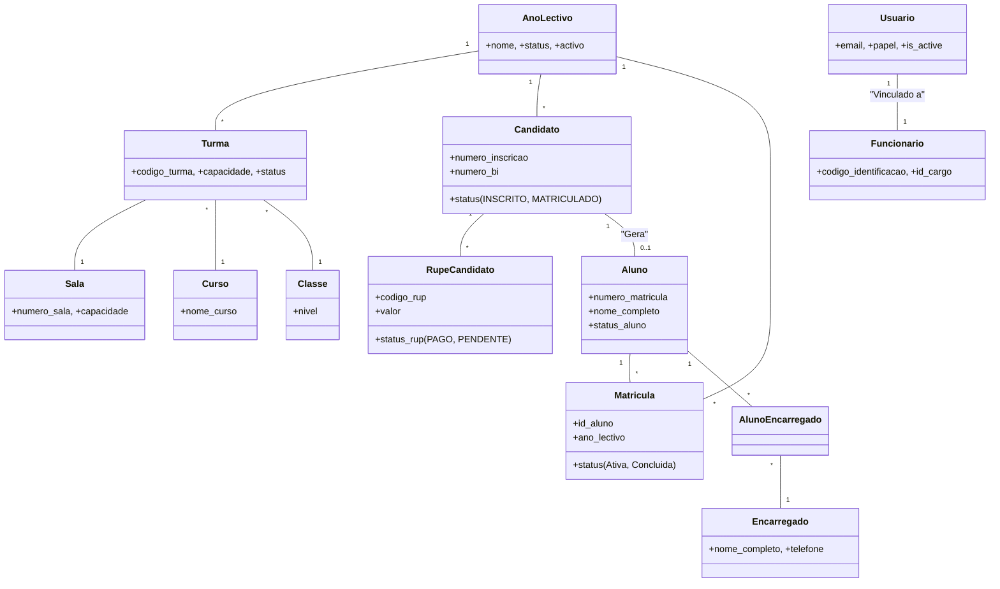

# Documentação do Sistema SGM - Diagramas e Arquitetura

Este documento contém a modelagem técnica do sistema SGM, detalhando os processos de negócio, a estrutura do banco de dados e o ciclo de vida das entidades.

## 1. Diagrama de Casos de Uso (Fluxo de Negócio)

O diagrama abaixo ilustra as interações entre os atores (usuários) e as funcionalidades do sistema, desde a candidatura até a gestão escolar.

```mermaid
useCaseDiagram
    actor "Candidato" as CandActor
    actor "Secretaria" as Sec
    actor "Administrador" as Admin
    actor "Professor" as Prof
    actor "Aluno/Encarregado" as UserActor

    package "Processo de Admissão" {
        usecase "Realizar Inscrição" as UC_Insc
        usecase "Gerar RUPE Inscrição" as UC_RUP_I
        usecase "Validar Pagamento" as UC_Val
        usecase "Agendar/Realizar Exame" as UC_Exa
        usecase "Publicar Resultados" as UC_Res
    }

    package "Gestão Acadêmica" {
        usecase "Configurar Ano/Turmas/Salas" as UC_Conf
        usecase "Efetivar Matrícula" as UC_Mat
        usecase "Importar Alunos (CSV)" as UC_Imp
        usecase "Lançar Notas e Faltas" as UC_Ped
    }

    Admin --> UC_Conf
    Admin --> UC_Ped
    
    Sec --> UC_Val
    Sec --> UC_Mat
    Sec --> UC_Imp
    
    Prof --> UC_Ped
    
    CandActor --> UC_Insc
    CandActor --> UC_RUP_I
    
    UserActor --> UC_Res
```

## 2. Diagrama de Classe (Modelo de Dados)

Representação das tabelas e seus relacionamentos. Nota: Apenas **Funcionários** possuem conta de acesso (Usuario).



## 3. Diagrama de Objetos (Exemplo de Instância)

Exemplo do estado dos dados após uma matrícula bem-sucedida.

```mermaid
objectDiagram
    object "Candidatura_01: Candidato" {
        numero = "INS20260001"
        status = "MATRICULADO"
    }
    object "RUP_PAGO: RupeCandidato" {
        codigo = "RUP-992288"
        status = "PAGO"
    }
    object "Mario: Aluno" {
        nome = "Mário Silva"
        num_matricula = 20260042
    }
    object "Matricula_Atual: Matricula" {
        ano = "2026/2027"
        turma = "10A_INF"
    }
    object "Maria: Encarregado" {
        nome = "Maria Silva"
    }

    Candidatura_01 ..> RUP_PAGO : "Liquidado em"
    Mario ..> Candidatura_01 : "Origem"
    Matricula_Atual ..> Mario : "Ativa para"
    Mario ..> Maria : "Dependente de"
```

## 4. Definições de Negócio

- **RUPE**: Registro Único de Pagamento ao Estado. Utilizado para taxas de inscrição e propinas.
- **Candidato**: Registro temporário para o processo de admissão.
- **Matrícula**: Vínculo anual obrigatório para ativação do aluno em uma turma.
- **Ano Lectivo**: Define as datas de operação e o estado global do sistema.
