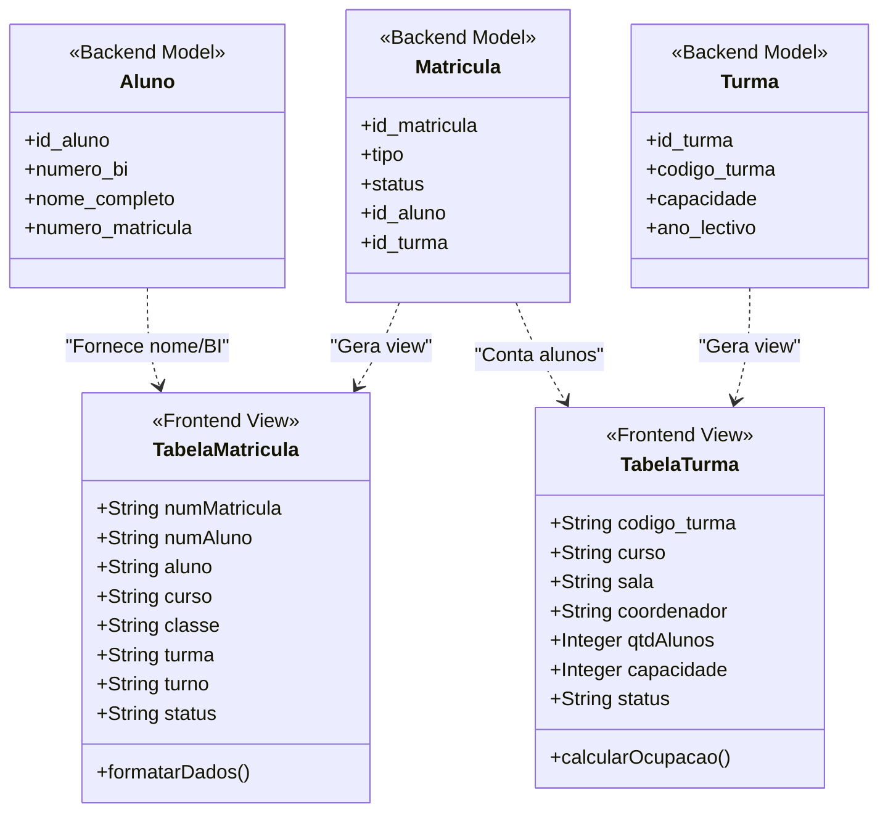
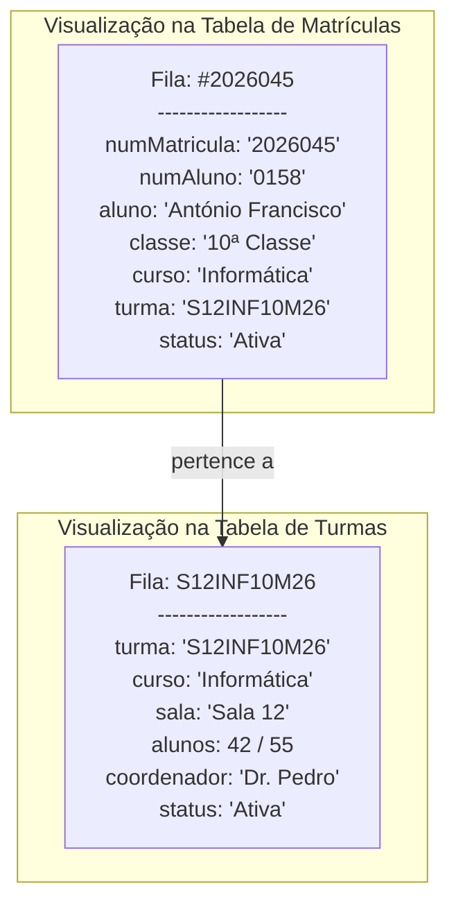
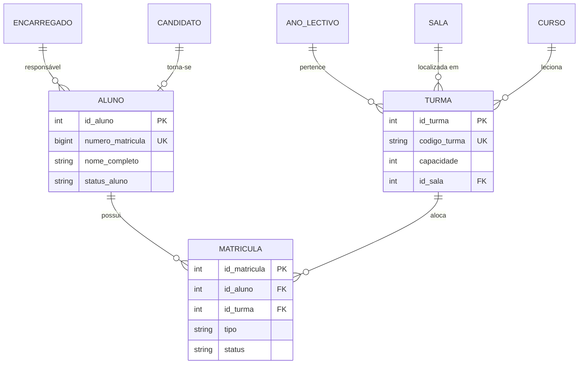

# 🏫 Sistema de Gestão de Matrícula (SGM) - Documentação Técnica

Este documento fornece uma visão arquitetural detalhada do SGM, descrevendo os processos de negócio, a estrutura de dados e as interações do sistema através de diagramas UML e MER.

---

## 1. Introdução e Propósito
O SGM tem como objetivo principal gerir o fluxo completo do aluno na instituição de ensino, desde a fase de candidatura e exame de admissão até a matrícula definitiva, renovação anual e gestão de turmas. 

O sistema garante a integridade histórica dos dados, impedindo alterações em anos letivos encerrados e automatizando o controle de lotação de salas.

---

## 2. Tecnologias Core
*   **Backend**: Python 3.x / Django / Django Rest Framework (DRF)
*   **Segurança**: Autenticação via JWT e controle de acesso baseado em cargos (RBAC).
*   **Frontend**: React.js com Tailwind CSS para uma interface moderna e responsiva.
*   **Banco de Dados**: PostgreSQL (Produção) / SQLite (Desenvolvimento).

---

## 3. Diagramas de Análise e Design (Visão Frontend & Backend)

### 3.1. Diagrama de Casos de Uso (UML)
Reflete as ações realizadas nas tabelas e formulários do frontend.

```mermaid
useCaseDiagram
    actor "Administrador" as Admin
    actor "Secretaria" as Sec
    actor "Candidato" as Cand

    package "Interface de Tabelas SGM (Frontend)" {
        usecase "Visualizar Tabela de Matrículas" as UC_TAB_MAT
        usecase "Visualizar Tabela de Turmas (Lotação)" as UC_TAB_TUR
        usecase "Filtrar por Curso/Ano/Classe" as UC_FILT
        usecase "Exportar Ficha de Matrícula (PDF)" as UC_PDF
        usecase "Realizar Permuta de Turmas" as UC_PERM
        usecase "Gerir Configurações de Ano Lectivo" as UC_CONF
        usecase "Efetuar Inscrição Online" as UC_INS
    }

    Admin --> UC_CONF
    Admin --> UC_TAB_TUR
    Admin --> UC_FILT
    
    Sec --> UC_TAB_MAT
    Sec --> UC_TAB_TUR
    Sec --> UC_PDF
    Sec --> UC_PERM
    Sec --> UC_FILT

    Cand --> UC_INS

    UC_TAB_MAT ..> UC_PDF : "<<extends>>"
    UC_TAB_TUR ..> UC_TAB_MAT : "Informa lotação"
```

---

### 3.2. Diagrama de Classes de Dados (Mapeamento Frontend-Backend)
Este diagrama mostra como os dados brutos do backend são transformados nas estruturas exibidas nas tabelas React.



---

### 3.3. Diagrama de Objetos (Instância Real nas Tabelas)
Demonstração dos dados exatamente como aparecem nas colunas das tabelas do frontend.



---

### 3.4. Modelo Entidade-Relacionamento (MER)
Relacionamentos lógicos que sustentam a persistência dos dados.



---

## 4. Estrutura de Tabelas no Frontend (React)
As tabelas principais implementadas no `frontend/src/pages/` seguem este padrão de colunas:

| Tabela | Colunas Principais | Actions |
| :--- | :--- | :--- |
| **Matrículas** | Nome, Nº Matrícula, Classe, Turma, Turno, Status | Ver Detalhes, Editar, Baixar Ficha, Permuta |
| **Turmas** | Nome Turma, Curso, Classe, Sala, Alunos (Ocupação), Estado | Editar, Ver Lista de Alunos |
| **Alunos** | Nome, Nº Aluno, BI, Telefone, Status | Ver Perfil, Histórico, Editar |
| **Inscritos** | Candidato, Curso Preferido, Nota Exame, Status | Lançar Nota, Aprovar, Matricular |

---

## 5. Estrutura de Diretórios do Projeto
```text
/backend
  /apis           - Lógica e Modelos Django
/frontend
  /src/pages      - Componentes de Tabela e Formulários
  /src/services   - API hooks (axios)
```

---
*Documentação gerada automaticamente para o SGM - Última revisão em: 28 de Fevereiro de 2026.*
