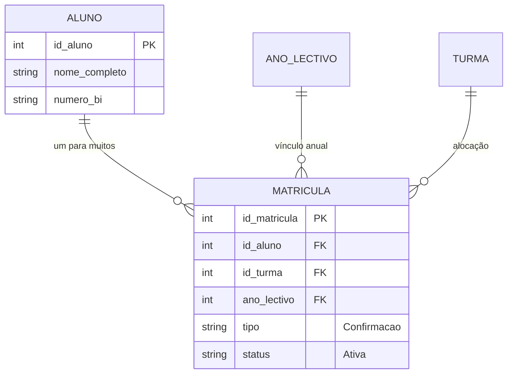

# 🎓 Plano de Fluxo: Confirmação de Matrícula (Renovação)

Este documento detalha a estratégia de implementação para o processo de **Confirmação de Matrícula**, garantindo integridade de dados, experiência de utilizador superior e eficiência administrativa.

---

## 🎯 1. Objetivo Principal
Estabelecer um processo onde alunos já existentes possam renovar o seu vínculo com a instituição para um novo **Ano Lectivo**, sem necessidade de criar novos perfis de aluno, evitando assim a duplicação de registos e facilitando a gestão do histórico escolar.

---

## 🛡️ 2. Regras de Negócio (Business Rules)

### 🔘 A. Identidade Única do Aluno
*   **Chave Primária Permanente:** O aluno possui um único `id_aluno` e `numero_matricula` para toda a sua vida académica na instituição.
*   **Vínculo Transacional:** Cada renovação gera um novo registo na tabela `Matricula`, vinculado ao mesmo `id_aluno`.

### 🔘 B. Validação de Elegibilidade
*   **Estado Académico:** Apenas alunos com estado `Concluido` no ano anterior podem confirmar para a classe seguinte.
*   **Dívidas/Pendências:** Bloqueio automático de confirmação para alunos com mensalidades em atraso (se integrado com financeiro).

### 🔘 C. Herança de Documentação
*   **Reaproveitamento de Arquivos:** O sistema deve herdar automaticamente o BI e o Certificado da matrícula anterior.
*   **Atualização Opcional:** Só é necessário novo upload se o documento tiver expirado ou se houver alteração de dados.

---

## 🔄 3. Fluxo do Processo (User Journey)

### Passo 1: Identificação do Aluno
O secretário acede à página de **Confirmação**, onde pesquisa o aluno por:
*   Nome Completo
*   Nº de BI
*   Nº de Matrícula (ID do sistema)

### Passo 2: Verificação de Dados
O sistema carrega os dados pessoais guardados.
*   *UI:* Exibe um resumo do perfil do aluno para confirmação visual rápida.
*   *Lógica:* Verifica se o aluno já possui matrícula ativa para o ano selecionado (evitando duplicidade).

### Passo 3: Configuração Académica
Seleção da nova jornada do aluno:
*   **Classe:** Sugestão automática da classe seguinte (ex: se fez 10ª, sugere 11ª).
*   **Turma/Turno:** Seleção baseada na disponibilidade de vagas em tempo real.

### Passo 4: Finalização
*   O sistema cria o registo na tabela `Matricula` com `tipo='Confirmacao'`.
*   Atualiza o campo `id_turma` no modelo `Aluno` para refletir o seu posicionamento atual.
*   Gera a nova **Ficha de Matrícula** em PDF.

---

## 📊 4. Estrutura de Dados (Sem Duplicação)

---

## 🎨 5. Premissas de Interface (UX/UI)

Para garantir uma interface "bonita" e profissional:

1.  **Skeleton Screens:** Enquanto os dados do aluno são carregados após a pesquisa.
2.  **Badges de Status:** Cores vivas para indicar se o aluno está apto ou não (🟢 Apto / 🔴 Pendente).
3.  **Visual de Herança:** Indicar visualmente que o BI está a ser herdado: `"📄 BI_Original.pdf (Herdado da matrícula 2024)"`.
4.  **Botões de Ação Rápida:** Na lista de alunos, um botão "Confirmar para 2026" que já pré-preenche o formulário.

---

## 🚀 6. Próximos Passos Técnicos

1.  [ ] Criar endpoint `api/alunos/search/` otimizado para busca de candidatos à renovação.
2.  [ ] Implementar lógica de "Auto-Promoção" no backend ao selecionar o Ano Lectivo.
3.  [ ] Ajustar o componente `NovaMatricula.jsx` para distinguir visualmente entre "Novo Ingresso" e "Confirmação" via parâmetros de URL.

---
*Assinado: Equipa de Desenvolvimento AntiGravity*
